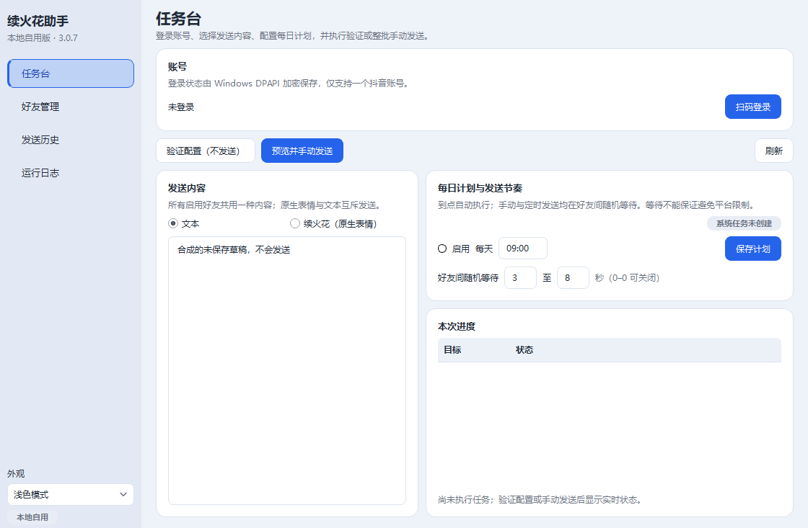

# SparkKeeper · 续火花助手

面向 **Windows 桌面**的本地工具：向本人已获授权的抖音好友发送固定文本或原生“续火花”表情，支持每日计划、发送前确认和离线更新。

**源码公开，仅按非商业许可证授权使用；欢迎外部 PR。不是抖音官方产品，不提供验证码、平台风控绕过或群发营销能力。**

[下载 Windows 版](https://github.com/Charlie-chulong/SparkKeeper/releases/latest) · [更新记录](CHANGELOG.md) · [反馈问题](https://github.com/Charlie-chulong/SparkKeeper/issues) · [参与贡献](CONTRIBUTING.md) · [非商业许可证](LICENSE)

## 现在能做什么

| 功能 | 说明 |
| --- | --- |
| 消息内容 | 固定文本或抖音原生大表情“续火花”，两种模式互斥 |
| 好友管理 | 按备注名或昵称搜索并强核验身份；好友表仅显示启用状态和昵称，支持只读扫描、整行多选、批量启停和删除 |
| 发送安全 | 发送前复核身份，整批预览确认，同一天防重复，结果不确定时不自动重试 |
| 每日计划 | Windows 任务计划执行，可配置好友间随机等待；错过计划需人工确认补跑 |
| 使用体验 | 同用户同登录会话单实例，重复启动唤醒已有窗口；不确定结果合并提醒 |
| 外观与记录 | 浅色、暗夜、跟随系统三态切换并保存；事件、发送尝试和进度的机器状态以中文展示 |
| 版本更新 | 推荐双击用户级安装 EXE；3.0.3 原位升级自动暂停并恢复本安装的 Windows 计划状态，ZIP 仍手动停用 |

没有多账号、群聊、联网自动更新、云端代发或后台静默升级。网页结构和平台规则可能变化，不保证永久可用、避免账号限制或必然延续火花。

## 界面预览

以下截图来自真实桌面界面，仅使用合成示例数据，不含真实好友、登录态或聊天记录。



## 下载安装

**普通用户不需要安装 Python、Git 或额外下载 Chromium。** 完整 Windows 包已包含运行环境和浏览器。

| 项目 | 要求或验证范围 |
| --- | --- |
| 已验证环境 | Windows 11 x64 |
| 其他系统 | Windows 10、Windows ARM64、macOS、Linux 未完成支持验证，不承诺可用 |
| 账号与网络 | 本人完成扫码登录；网页操作需要能够正常访问抖音 |
| 程序目录 | 当前用户可写的固定目录，避免需要管理员权限的位置 |

1. 打开 [最新 Release](https://github.com/Charlie-chulong/SparkKeeper/releases/latest)，**推荐下载 `SparkKeeper-3.0.7-Setup.exe`**（以后选择对应新版的 `Setup.exe`），并取得同页 SHA-256 校验文件。**不要把 GitHub 的 `Source code` 压缩包当作 Windows 程序。**
2. 双击安装 EXE，按向导安装到当前用户目录；默认是 `%LOCALAPPDATA%\Programs\SparkKeeper`，不需要管理员权限。已有安装会识别原安装路径；不要另建带版本号的目录。
3. 从安装目录运行 `SparkKeeper.exe`；如果在向导中勾选了快捷方式，也可从开始菜单或桌面启动。由本人完成扫码登录和可能出现的人工验证。
4. 在“好友管理”中按备注名或昵称搜索确认好友，或先“扫描火花好友（不发送）”再预览导入。搜索不使用抖音号；发送前仍须以规范抖音个人主页或可信单聊 SDK 会话摘要核验身份，昵称相同不自动选第一项。扫描导入的新好友默认停用，核对后再启用。
5. 在任务台选择文本或“续火花（原生表情）”，先点击 **“验证配置（不发送）”**。
6. 手动发送时检查整批预览；需要每日执行时，核对时间、等待范围和目标，再启用并保存计划。

原生“续火花”不是小表情“[续火花吧]”。界面中的预览图不代表已经发送。发送结果不确定也不代表未发送，请先人工核对，不要直接覆盖重发。

**ZIP 备用方案：** 下载 `SparkKeeper-3.0.7-win64.zip`，完整解压，将包内 `SparkKeeper` 文件夹放到当前用户可写的固定目录，再运行其中的 `SparkKeeper.exe`。不要只复制 EXE，也不要直接把 ZIP 合并覆盖到安装器管理的目录。

安装包目前**没有代码签名**，Windows SmartScreen 可能提示“未知发布者”或阻止运行。先核对仓库、Release 版本及校验值；来源或告警有疑问时停止安装并反馈。SHA-256 只能检测文件变化，不能代替发布者签名。不要关闭杀毒软件、SmartScreen 或绕过组织安全策略。

### 外观与中文记录

左侧导航底部的 **“外观”** 可选择“浅色模式”“暗夜模式”或“跟随系统”。切换立即作用于主界面、已打开的预览、菜单及状态颜色，忙碌时也可切换。偏好自动保存在本地数据库，重启后恢复；首次使用、偏好缺失或无效时默认浅色。“跟随系统”响应系统配色通知，无法识别系统配色时使用浅色；固定浅色或暗夜不随系统改变，也不会修改 Windows 全局主题。

四个页面、模式与筛选展开列表、操作及右键菜单、提示框和预览/确认窗口统一使用圆润边框与浅暗配色；选中项、表头和滚动条也采用相同风格。保留原生标题栏、窗口拖动与缩放，以及原有鼠标和键盘操作。

关闭窗口时会等待外观偏好写入完成；保存失败则恢复上次成功保存的选择，并保留完整错误详情。发送历史、运行日志列表和详情、本次进度中的机器状态使用中文；好友昵称、消息正文等用户内容和原始异常、调用栈等诊断原文不翻译、不改写。

## 如何更新

### 推荐：双击新版安装 EXE

1. 等待发送、扫描、登录及独立计划任务正常结束，关闭所有旧窗口。**使用 3.0.3 或更新的 Setup 原位升级时，无需先手动停用属于本安装目录的每日计划。**
2. 从可信 Release 下载新版 `SparkKeeper-版本号-Setup.exe` 并核对 SHA-256，双击安装。安装器使用固定 AppId 识别已有安装，必须沿用原安装路径升级，无需先卸载旧版；不允许通过另选目录或 `/DIR` 绕过，也拒绝降级。
3. 安装器核对任务归属后，自动暂停本安装的 Windows 计划；只有程序文件完整校验通过，才恢复安装前的启用状态。原本停用的保持停用，没有任务的不新建；不修改应用内计划配置，不自动补跑。若提示占用，等待任务正常结束、退出旧版后重试；安装器不会终止正在运行的任务或强杀进程。
4. 安装成功后可运行新版核对好友、登录状态和计划。同目录正常升级无需为了恢复任务而重新保存计划；若向导明确提示需要人工核对，则先处理提示，不要直接启用。

**3.0.6 数据升级：** 首次打开旧数据库时升级到 schema 4，先做一致性备份，再在事务中删除好友抖音号字段并规范稳定身份及名称搜索值；保留好友本地 ID、启用状态、发送历史、人工覆盖审计和当天防重复依据。无法确认稳定身份、身份冲突或其他迁移错误会回滚，不清空数据或静默跳过记录。升级后不要用旧程序或旧数据库快照覆盖回退。

正常升级和卸载会校验已有程序的发行清单及 SHA-256；没有维护记录的文件损坏、手工替换组件或未知额外文件会导致拒绝继续，不会直接清除未知文件。有维护记录的中断安装按下述修复流程处理，仍须验证完整性。没有 `release-manifest.json` 的旧便携目录不能原地覆盖，请迁入新的默认安装目录。出现错误时保留安装日志并反馈，不要混合新旧依赖或删除用户数据来绕过检查。

**取消、失败或断电后：** 只有尚未改动程序文件，或已确认原文件完整时，才能安全恢复原任务状态；不能保证所有失败都会恢复。部分更新、完整性校验失败或恢复 Windows 任务失败时，会保留 `%LOCALAPPDATA%\SparkKeeper\maintenance\pending.json` 维护记录，计划保持暂停。3.0.3 及更新的程序在初始化数据库前阻止继续运行并提示修复。请保留记录与安装日志，重新运行可信的同版或更新版 Setup，选择原安装目录完成修复；不要删除维护记录、手动启用任务或拼接新旧文件绕过保护。没有单独的“恢复计划”界面按钮。

安装期间若任务被人工改动、删除或重新创建，安装器不会覆盖定义或替用户重建任务。文件验证完成后可能提示需人工核对并在新版重新保存计划；只有任务恢复成功，或已验证文件并明确转为人工处理后，维护阻断才会解除。

**旧版边界：** 3.0.3 新增同一 Windows 用户跨登录会话的维护互斥；旧版不认识此保护。首次升级仍须结束旧任务、退出旧版，安装期间不要手动启动旧 EXE、另一份便携副本或其他登录会话中的旧版。自动暂停只阻止后续系统触发，不等于终止已运行的任务。

**首次从 ZIP 便携版迁入：** 这不是同目录原位升级。先在旧便携版停用每日计划并保存，等待任务结束并正常退出，再安装到默认用户级目录。仍指向旧目录、身份不符或定义不明的已启用同名任务会使安装器拒绝继续；安装器不会擅自停用、迁移或重新绑定它，请先核对并人工停用旧任务。同一 Windows 用户下继续使用 `%LOCALAPPDATA%\SparkKeeper` 中的已有数据，不要复制数据库或登录态到程序目录。迁入完成后，在新版核对配置、按需启用并重新保存每日计划，使 Windows 任务中的绝对路径指向新 EXE；旧快捷方式和任务栏固定项也需改为新路径。不要再运行旧目录中的副本。

**安装版换位置：** 不要直接移动目录或在升级时指定另一目录。3.0.3 卸载会彻底清除当前用户的共享数据，**不要为保留配置而采用“先卸载再安装”**。只有接受删除全部本地数据后，才卸载并安装到新位置；新位置需重新登录、配置好友及计划并更新快捷方式。普通升级始终沿用原目录。

### 备用：继续使用 ZIP 离线更新

仅更新便携目录时，将新 ZIP 完整解压到**另外的临时目录**，双击新包根目录的 **`更新.cmd`** 并选择已有便携程序目录，不要直接合并覆盖旧文件；**ZIP 流程没有 Setup 的自动暂停/恢复能力**，更新前仍必须手动停用并保存计划、等待任务结束并正常退出，更新后核对配置再人工启用计划。

ZIP 更新入口检查产品、版本、文件 SHA-256、额外文件、目录路径、程序占用和计划状态，准备同卷副本后完整替换，旧程序目录保留为备份。不会强杀发送中的进程、覆盖用户数据库或自动补跑。此目录备份机制不是安装器的自动回滚承诺。

从旧开发版首次升级时必须先退出旧版，它们没有单实例协议。ZIP 更新中没有文件清单的旧包需要明确接受迁入。后续不要随意移动程序目录，因为 Windows 计划任务使用绝对路径。

更新失败时不要手工拼接新旧依赖。数据库迁移前会做一致性备份，但新版已有发送记录后不能直接恢复旧数据库，否则可能丢失当天防重复依据。遇到拒绝降级或不兼容数据库，请使用兼容修复版。

`更新.cmd` 调用系统 Windows PowerShell，仅对当前进程设置执行策略，不提权、不联网、不永久修改系统策略。组织策略禁用脚本时不绕过限制。SHA-256 用于检测损坏，不是发布者数字签名；请只从可信 Release 下载。

### 卸载与彻底清理

等待任务正常结束并退出所有窗口，再从 Windows“已安装的应用”中卸载 SparkKeeper。**3.0.3 卸载在你明确确认后，会不可逆地删除本安装的程序文件，以及当前 Windows 用户 `%LOCALAPPDATA%\SparkKeeper` 下的全部共享数据**，包括数据库、登录态、好友、消息配置、发送历史、防重复记录、任务 XML、日志、诊断输出、备份和维护记录；不提供“保留数据”选项。

**同一 Windows 用户的其他安装副本和 ZIP 便携版也使用这份共享数据，清理会一并影响它们。** 如果还有另一副本运行、同名计划仍指向其他目录/归属不明（即使已停用），或其他关联计划仍引用这份共享数据，卸载会中止并提示人工处理，不擅自改动或删除它们。卸载器仅暂停并删除经身份、执行参数和路径核对、属于本安装且定义未被另改的 Windows 计划；不会强杀正在运行的任务。

交互卸载必须确认不可逆清理；静默卸载也必须通过 `/PURGEUSERDATA`（不带值）明确授权，没有授权不执行。**正常安装、原位升级和取消卸载不删除用户数据。**

**卸载失败时：** 保留维护记录和错误信息，优先重新运行原安装目录中保留的卸载器，再次确认后继续（静默仍需 `/PURGEUSERDATA`）。一旦开始清理数据，失败时不会恢复计划，也不承诺恢复已删除的数据。只有原卸载器损坏或无法使用时，才用原目录的同版或更新版 Setup 兜底修复；尚未完成的已授权全清会继续，**不重建旧任务、不启动程序**，完成页提示如需删除修复后的程序请再次卸载。若此前已完成全清、仅安装器收尾中断，修复不会因旧完成凭证再次删除后来产生的数据。

修复安装不能找回已清除的数据，也不能将卸载视为安全回滚方式。重新使用时需重新登录和配置，历史防重复依据已清除，发送前必须人工核对。

## 常见问题

**一直显示“结果不确定”，能直接再发吗？** 不能据此判断未送达。先检查“发送历史”并人工核对聊天。关闭提醒仅表示已知晓，不改变发送状态或解除当天防重复。

**扫描到了好友，为什么没有发送？** 扫描导入的新好友默认停用；只有已启用且身份复核通过的目标才会参与发送，当天防重复也可能跳过目标。

**退出窗口后每日计划还会执行吗？** 已启用并保存的 Windows 计划由独立 worker 执行，不要求主窗口一直打开，但要求当前 Windows 用户保持登录且电脑可运行。关机不能执行；是否能从睡眠唤醒受系统、电源及设备设置影响，不能保证。错过后不会自动补发。

**较长计划会在 30 分钟时中断吗？** 当前源码生成的任务不再设置固定 30 分钟截止；已注册的旧任务不会在启动时自动改写，更新后需在任务台核对并重新保存计划一次。互斥、防重复和错过后不自动补发的规则不变。

**扫码登录可以取消吗？** 可以点击“取消登录”，等待浏览器正常关闭。交互阶段取消或尚未删除旧凭据就失败时，保留原状态；旧凭据删除后若账号或新凭据保存失败，则保持不可发送，需要重新扫码。发送前账号无法核验或与保存账号不一致时，整批停止，不尝试用旧好友配置继续发送。

**安装、更新或卸载提示文件占用怎么办？** 等待任务正常结束并退出旧版，包括独立计划任务。Setup 原位升级会自动暂停归属本安装的计划；ZIP 更新和首次便携迁入仍须先手动停用并保存计划。不要强杀正在确认发送结果的程序，也不要只覆盖 EXE。

**为什么仍打开旧版？** 检查窗口显示的版本和程序目录；目录单行显示，较长时省略，悬停可查看完整路径。旧快捷方式或任务栏固定项可能仍指向旧路径，应改为新版，并在新路径重新保存计划。

**登录态能复制给别人使用吗？** 不应分享。登录态由当前 Windows 用户的 DPAPI 加密，不是可跨用户分发的配置文件；接收者应自行登录。

## 数据与公开反馈安全

正式 EXE 的数据位于 `%LOCALAPPDATA%\SparkKeeper`，与程序目录分离；源码运行默认使用 `work/local-data`。登录态使用 DPAPI 加密，好友、完整消息文本、发送历史和原始错误事件保存在本机。

**本地日志不脱敏，不等于允许公开上传。禁止向本仓库、PR、Issue、评论或附件提交以下真实数据：**

- Cookie、Token、扫码登录资料、DPAPI 登录态、浏览器 Profile 或 Storage State；
- SQLite 数据库及其 WAL、备份、真实聊天正文、好友身份、个人主页或发送记录；
- 含上述信息的配置、任务 XML、截图、录屏、日志和诊断文件。

提交复现时使用合成数据，或经过彻底匿名化、确认不能关联真实人的最小片段。不要上传整份数据库、完整原始日志或私人截图。`.gitignore` 只是辅助，不能清除已经进入 Git 历史或附件的数据。

`SPARK_KEEPER_ROOT` 是开发/测试的数据路径覆盖配置；设置它时离线更新器拒绝盲目更新。备份同样敏感，应仅留在本人设备。误提交敏感数据的处理方式见 [贡献规范](CONTRIBUTING.md)。

## 欢迎外部 PR

接受修复、测试、文档和合理的功能改进。重大改动先开 Issue 讨论；每个 PR 尽量聚焦一个问题，说明验证方式、兼容性和是否涉及数据迁移。

贡献者应拥有提交内容的合法权利，并同意按本项目的 **PolyForm Noncommercial License 1.0.0** 提供贡献；不要求转让版权。不得提交他人的受限代码、真实登录态或聊天数据。详细要求见 [CONTRIBUTING.md](CONTRIBUTING.md)，提交 PR 时请完成模板中的检查项。

## 开发与构建

开发需要 Windows x64、Python 3.12 或更高版本；构建安装 EXE 还需从 [Inno Setup 官网](https://jrsoftware.org/isdl.php) 安装 **Inno Setup 6.5 或更新的 6.x 版本**。安装向导使用仓库中固定版本的官方简体中文翻译，不在构建时联网拉取语言文件。GitHub 发布还需要 Git 和开发者本人登录的 GitHub CLI。

```powershell
python -m venv .venv
.venv\Scripts\python.exe -m pip install -e ".[dev]"
.venv\Scripts\python.exe -m playwright install chromium
.venv\Scripts\python.exe -m pytest
.venv\Scripts\python.exe -m ruff check src tests tools
.venv\Scripts\python.exe tools\build_portable.py
.venv\Scripts\python.exe tools\build_installer.py
```

先运行 `build_portable.py` 生成 `outputs/release/SparkKeeper` 和备用 ZIP，再运行 `build_installer.py` 包装同一程序目录；构建工具不会执行安装器。它自动查找 `Program Files`、`Program Files (x86)` 或 `%LOCALAPPDATA%\Programs` 下的 `Inno Setup 6\ISCC.exe`，也可用 `--iscc` 指定编译器完整路径；`--payload`、`--output-dir` 可指定程序目录和输出目录。

默认输出 `outputs/release/SparkKeeper-3.0.7-Setup.exe`、`SparkKeeper-3.0.7-Setup.exe.sha256` 和本地构建凭据 `SparkKeeper-3.0.7-Setup.exe.build.json`。构建凭据绑定安装 EXE、安装脚本/安全辅助脚本、编译器和程序清单内的构建来源，发布预检需要保留它，但不上传到 Release。即使版本号不变，业务源码、资源或便携构建输入改变后也必须重建便携包，再构建安装器；仅安装器专属输入变化时重建安装器。PE 产品/版本与 `asInvoker` 检查不是代码签名认证，也不替代实际安装验收。

便携构建使用项目 `.venv` 中的 Python（如上面的 `.venv\Scripts\python.exe`），以记录实际打包环境的依赖和工具版本；构建前后核对输入内容未变化。来源绑定使用内容摘要而非提交号，仍允许先构建后提交；仅无关文档或 Git HEAD 变化不要求重建。缺少来源记录的旧产物不能用于新的安装器构建或发布，但已发行旧包的运行期升级维护读取仍受支持。

测试和复现必须使用临时目录、合成数据，不访问真实登录态或触发真实发送。`--smoke` 使用临时数据检查当前构建的独立窗口，不用于正常单实例验收。

版本唯一来源是 `src/spark_keeper/__init__.py` 的 `__version__`。正式版例如 `3.0.0`；候选版在 Python 中使用 `3.0.1rc1`，对外标签和文件名使用 `3.0.1-rc.1`。程序目录中的 `release-manifest.json` 用于更新包完整性检查。

## 维护者发布流程

1. 修改唯一版本号和 `CHANGELOG.md`，完成回归、构建、安装/原位升级保留数据、确认卸载清空隔离测试数据及 ZIP 解压更新验证；卸载验收仅使用私有 TestAppId 与专用数据目录，不操作真实用户数据。文档说明不等于已完成安装验收。
2. 检查没有跟踪运行数据，提交源码并创建对应 Git 标签，再推送分支和标签。
3. 运行 `tools/publish_release.py --repo Charlie-chulong/SparkKeeper --dry-run`。安装器默认取 ZIP 同目录中的对应版本文件，也可用 `--installer` 指定；确保安装 EXE、ZIP、各自校验、本地安装器构建凭据及 Qt 对应源码齐全。
4. 明确使用 `--publish` 并确认目标，工具才会创建 Release 草稿并上传安装 EXE、备用 ZIP、对应校验文件及 Qt 对应源码。
5. 检查草稿中的版本、说明、许可和资产，人工发布后再分发链接。

不在软件中嵌入 GitHub Token，不在每次提交后自动发布，不提供联网自动更新。已经发布的历史标签和资产不因本次文档、许可更新被静默替换。

## 许可证与第三方权利

**本项目自有代码自新增 [LICENSE](LICENSE) 的提交起，采用 [PolyForm Noncommercial License 1.0.0](https://polyformproject.org/licenses/noncommercial/1.0.0)，仅按该许可证授权非商业用途。** 具体许可范围、非商业用途定义、分发通知义务和免责条款以许可证原文为准。该许可含非商业限制，因此本项目称为“源码公开、非商业授权”，不宣称采用 OSI 开源许可证。

历史标签及当时发布的包保持其原有许可状态；不移动 `v3.0.0` 标签，也不替换其已有二进制包。`3.0.1` 起的 Windows 发行包携带根目录许可证。欢迎外部贡献不代表允许商业使用。

项目许可不覆盖第三方依赖、商标或素材。详见 [THIRD_PARTY_NOTICES.txt](THIRD_PARTY_NOTICES.txt)：Qt/PySide6 动态库仍按 LGPL v3 分发，对应未修改源码随 Release 提供，允许兼容修改版动态库替换及调试；更新清单不限制运行时替换这些组件。抖音原生表情预览属于其权利人，仅展示所选资源，不作为本软件图标。

3.0.2 起的安装器使用 [Inno Setup](https://jrsoftware.org/isinfo.php) 制作，安装引擎适用其自身的 [Inno Setup License](https://jrsoftware.org/files/is/license.txt)，不是本项目的非商业许可证。Inno Setup 自身允许商业用途，并不授予 SparkKeeper 自有代码商业使用权；本项目的非商业限制也不改变 Inno Setup 或其他第三方组件的许可。
